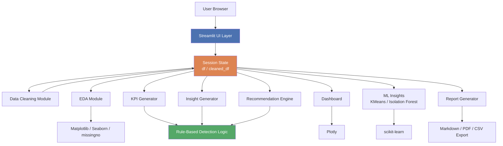
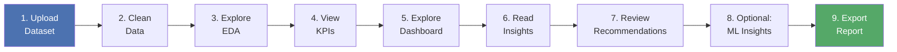

# 📊 InsightGen AI

**Automated Business Intelligence & Decision Support Platform**

InsightGen AI is a full-stack, Python-only business intelligence application. Upload any CSV or Excel dataset and it automatically cleans the data, runs exploratory analysis, generates business KPIs, builds an interactive dashboard, surfaces plain-English insights, produces rule-based recommendations, runs optional machine learning (customer segmentation and anomaly detection), and exports a downloadable report — all without writing a single line of code yourself.

Built entirely with **Streamlit**, **pandas**, and **scikit-learn** — no HTML, CSS, JavaScript, or backend framework required.

---

## ✨ Features

| Module | What it does |
|---|---|
| 📁 **Dataset Upload** | Upload CSV/Excel, instant preview, row/column/null/memory summary |
| 🧹 **Data Cleaning** | Duplicate removal, missing value handling, IQR-based outlier detection & treatment, automatic type correction, date parsing, column name standardization |
| 📈 **Exploratory Data Analysis** | Summary statistics, missing value heatmap, correlation matrix, histograms, boxplots, categorical analysis, skewness/kurtosis |
| 📌 **Automatic KPI Generator** | Detects dataset type (Retail / HR / Finance / Customer / Generic) via rule-based keyword scoring, then generates relevant KPIs |
| 📊 **Interactive Dashboard** | Plotly-powered bar, line, pie, scatter, heatmap, boxplot, and histogram charts with live filtering |
| 💡 **Business Insight Generator** | Rule-based, plain-English insights (top/bottom performers, extremes, category dominance, correlations, group comparisons) |
| ✅ **Recommendation Engine** | Priority-ranked, rule-based business recommendations (imbalance, underperformance, high variability, strong correlations, data quality) |
| 🧬 **ML Insights** *(optional)* | KMeans customer segmentation with elbow method, Isolation Forest anomaly detection |
| 📤 **Report Generation** | One-click export as Markdown, PDF, or cleaned CSV |

All insight and recommendation logic is **100% rule-based statistical analysis** — no external AI/LLM API is used anywhere in this project.

---

## 🛠️ Tech Stack

- **Language:** Python 3.12
- **Frontend/App Framework:** Streamlit
- **Data Processing:** pandas, NumPy
- **Visualization:** Matplotlib, Seaborn, Plotly, missingno
- **Machine Learning:** scikit-learn (KMeans, Isolation Forest, StandardScaler)
- **Report Export:** fpdf2
- **Automated EDA:** ydata-profiling
- **Testing:** pytest
- **Version Control:** Git & GitHub

---
## 🏗️ Architecture



*All processing modules read from and write back to a shared session state, so data flows consistently through the pipeline regardless of navigation order.*

## 🔄 User Workflow



*Each step is optional and independently accessible via the sidebar — the app doesn't force a rigid sequence, but this is the typical analysis flow.*

---

## 📂 Project Structure
InsightGen-AI/
├── app.py # Main Streamlit application
├── requirements.txt # Python dependencies
├── README.md
├── .gitignore
├── src/
│ └── utils.py # Reusable, testable logic (no Streamlit dependencies)
├── tests/
│ └── test_utils.py # pytest unit tests
├── logs/ # Runtime log files (gitignored)
└── venv/ # Virtual environment (gitignored)

---

## 🚀 Getting Started

### Prerequisites
- Python 3.12 installed ([python.org](https://www.python.org/downloads/))
- Git installed ([git-scm.com](https://git-scm.com/))

### Installation

1. **Clone the repository**
```bash
   git clone https://github.com/atchaya436/InsightGen-AI.git
   cd InsightGen-AI
```

2. **Create and activate a virtual environment**
```bash
   python -m venv venv
   # Windows (PowerShell)
   .\venv\Scripts\Activate.ps1
   # macOS/Linux
   source venv/bin/activate
```

3. **Install dependencies**
```bash
   pip install -r requirements.txt
```

4. **Run the app**
```bash
   streamlit run app.py
```

5. Open your browser to `http://localhost:8501`

### Running Tests

```bash
pytest
```

---

## 📖 Usage

1. Navigate to **Upload Dataset** and upload any CSV or Excel file
2. Visit **Data Cleaning** to remove duplicates, handle missing values, and treat outliers
3. Explore **EDA** for statistical summaries and distributions
4. Check **KPIs** for automatically detected business metrics
5. Use the **Dashboard** to interactively filter and visualize your data
6. Read **Insights** and **Recommendations** for automated analysis
7. Try **ML Insights** for customer segmentation or anomaly detection
8. Export everything from the **Reports** page

---

## 🧠 How It Works

- **Dataset type detection** and **insight/recommendation generation** use rule-based keyword scoring and statistical thresholds — fully transparent and explainable, with no black-box AI involved.
- **Outlier detection** uses the standard IQR (Interquartile Range) method.
- **Customer segmentation** uses KMeans clustering with feature scaling (StandardScaler) and the Elbow Method for choosing cluster count.
- **Anomaly detection** uses Isolation Forest, which flags unusual *combinations* of values across multiple columns, not just single-column outliers.

---

## 👤 Author

Built by Atchaya as a portfolio project demonstrating Python, data science, and business intelligence engineering skills.

